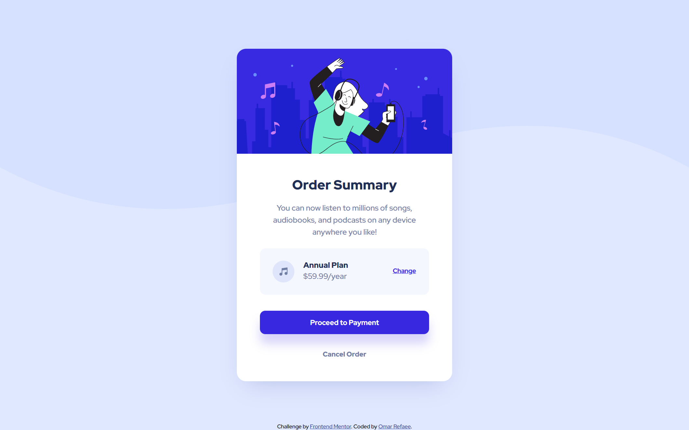

# Frontend Mentor - Order summary card solution

This is a solution to the [Order summary card challenge on Frontend Mentor](https://www.frontendmentor.io/challenges/order-summary-component-QlPmajDUj).

## Table of contents

-   [Overview](#overview)
    -   [The challenge](#the-challenge)
    -   [Screenshot](#screenshot)
    -   [Links](#links)
-   [My process](#my-process)
    -   [Built with](#built-with)
    -   [Useful resources](#useful-resources)
-   [Author](#author)

## Overview

### The challenge

Users should be able to:

-   See hover states for interactive elements

### Screenshot

### Links

-   Solution URL: [Solution URL](https://www.frontendmentor.io/solutions/order-summary-component-responsive-pure-html-css-i4zZnNQ-Gz)
-   Live Site URL: [Live Site URL](https://order-summary-component-or.netlify.app/)

## My process

### Built with

-   Semantic HTML5 markup
-   CSS
-   Flexbox
-   Mobile-first workflow

### Useful resources

-   [Box Shadow Generator](https://cssgenerator.org/box-shadow-css-generator.html) - This helped me for box shadow creation

## Author

-   Website - [Omar Refaee](https://www.github.com/omarrefaee)
-   Frontend Mentor - [@OmarRefaee](https://www.frontendmentor.io/profile/OmarRefaee)
